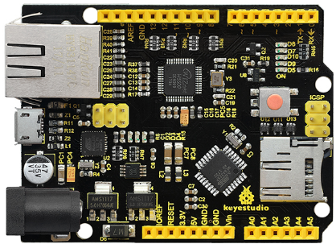
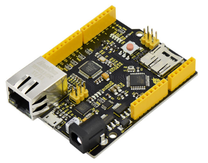
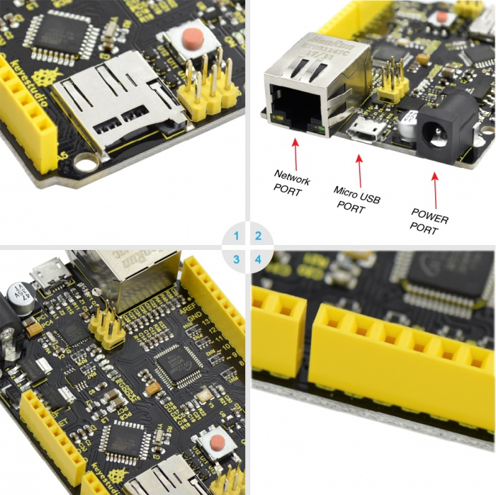
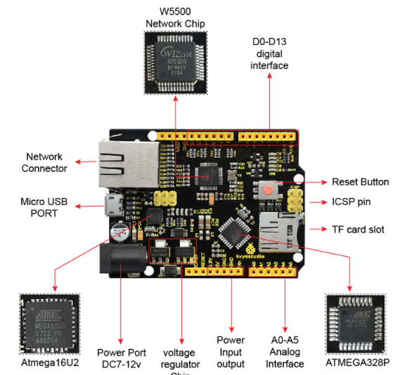
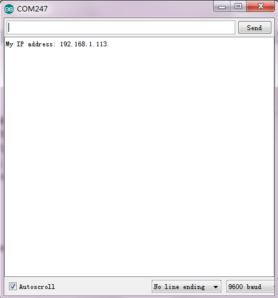
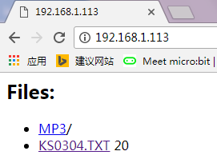
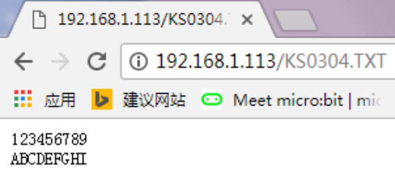
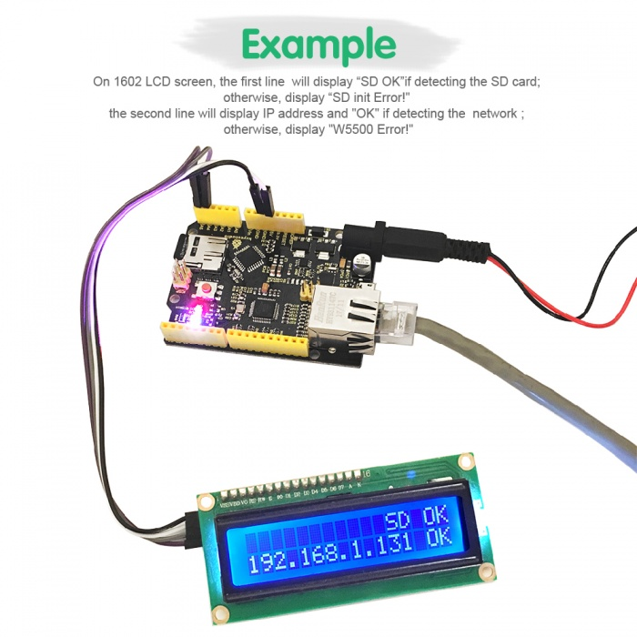
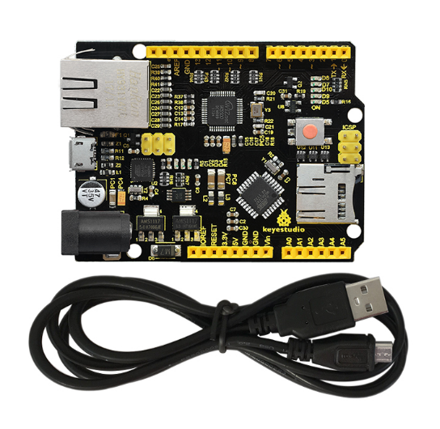

# KS0304 Keyestudio W5500 ETHERNET DEVELOPMENT BOARD (WITHOUT POE)



## 1. Description

Keyestudio W5500 is based on the microcontroller of Arduino Ethernet.We have integrated USB download, TF card slot and more functions on it, fully compatible with UNO pins.

You can quickly make your controller access to internet to build your network application.

Onboard comes with W5500 network module,which can make Arduino as simple Web server or read Arduino digital and analog interface via network control. 

It can achieve a simple Web server through using Ethernet libraries in IDE, meanwhile, support MicroSD card (TF card) read and write, really with powerful functions.



Note: TF card can’t be connected to control board when reading IP address code, otherwise, IP address might be not read Code is only allowed to be test on 1.4 version IDE.

Meanwhile, its MAC address is random. You can set MAC address in the code.

## 2. Parameters

- 1．Main Chip：ATMEGA328 microcontroller
- 2．USB power supply：5v
- 3．external power：7-12v，(9v recommended)
- 4．digital input/output pins: 14（of which 6 pins support PWM）
- 5．analog input pin: 6
- 6．built-in flash memory：32K
- 7．SRAM: 2k
- 8．EEPROM:1K
- 9．clock frequency：16MH
- 10.TCP/IP Ethernet controller W5500、MicroSD card mount（TF card）、MicroUSB



## 3. Interfaces and Elements Introduction



**About Chip:**

- 1.ATMEGA328P-AU
- 2.Atmega16U2
- USB to serial chip
- 3.AMS1117
- 4.5V and 3.3V stabilivolt chip
- 5.W5500 network chip

**About Interface:**

**1. ICSP interface**

- Program firmware to ATMEGA328P-AU

**2. Digital interface D0-D13**

- Serial communication：D0(RX) and D1(TX)
- External interruption：D2（interrupt 0）、 D3（interrupt 1）
- PWM interface：D3、D5、D6、D9、D10 、D11
- SPI communication：D10(SS)、D11(MOSI)、D12(MISO)、D13(SCK)

**3. ICSP interface**

- Program firmware to Atmega16U2

**4. USB port**

- For program download or serial debugging

**5. DC power connector**

- Access to 7V-12V voltage

**6. Power output port**

- Output 3.3V or 5V，for external power supply or common ground handle

**7. Analog interface A0-A5**

- IIC communication：A4(SDA) and A5(SCL)
- Also can be used as digital interface：A0(D14)、A1(D15)、A2(D16)、A3(D17)、A4(D18)、A5(D19)

**8. Network connector**

- RJ－45 network port

**About Component:**

- 1.reset button
- 2.16MHz crystal oscillator
- 3.25MHz crystal oscillator

## 4. Test Code

**Library files and code download：**[Resource](./Resource.7z)

**Code A:**

```
#include <SPI.h>
#include <Ethernet55.h>

// set MAC address 
#if defined(WIZ550io_WITH_MACADDRESS) // Use assigned MAC address of WIZ550io;
#else
byte mac[] = {0xDE, 0xAD, 0xBE, 0xEF, 0xFE, 0xED};
#endif  

void setup() 
{  
  Serial.begin(9600);
  if (Ethernet.begin(mac) == 0) 
  {
      Serial.println("Failed to configure Ethernet using DHCP");
      // connection fails, stop program run. 
      for(;;);
  }

  // print out your local IP address
  Serial.print("My IP address: ");
  for (byte thisByte = 0; thisByte < 4; thisByte++) 
  {
    // print out four byte IP address
    Serial.print(Ethernet.localIP()[thisByte], DEC);
    Serial.print("."); 
  }

  Serial.println();
}

void loop() 
{
}
```

**Code B**:

```
//in testing, check IP address of reticle through GET_IP routine
//for example, the tested IP address is 192.168.1.113
//namely intranet address allocated to testing reticle
#include <SdFat.h>
#include <SdFatUtil.h>
#include <Ethernet55.h>
#include <SPI.h>

/************ ETHERNET STUFF ************/
byte mac[] = { 0xDE, 0xAD, 0xBE, 0xEF, 0xFE, 0xED };  //MAC address
byte ip[] = { 192, 168, 1, 113 };     //IP address
EthernetServer server(80);

/************ SDCARD STUFF ************/
Sd2Card card;
SdVolume volume;
SdFile root;
SdFile file;

// store error strings in flash to save RAM
#define error(s) error_P(PSTR(s))

void error_P(const char* str) {
  PgmPrint("error: ");
  SerialPrintln_P(str);
  if (card.errorCode()) {
    PgmPrint("SD error: ");
    Serial.print(card.errorCode(), HEX);
    Serial.print(',');
    Serial.println(card.errorData(), HEX);
  }
  while(1);
}

void setup() {
  Serial.begin(9600);

  PgmPrint("Free RAM: ");
  Serial.println(FreeRam());  

  // initialize the SD card at SPI_HALF_SPEED to avoid bus errors with
  // breadboards.  use SPI_FULL_SPEED for better performance.
  pinMode(10, OUTPUT);                       // set the SS pin as an output (necessary!)
  digitalWrite(10, HIGH);                    // but turn off the W5500 chip!

  if (!card.init(SPI_HALF_SPEED, 4)) error("card.init failed!");

  // initialize a FAT volume
  if (!volume.init(&card)) error("vol.init failed!");

  PgmPrint("Volume is FAT");
  Serial.println(volume.fatType(),DEC);
  Serial.println();

  if (!root.openRoot(&volume)) error("openRoot failed");

  // list file in root with date and size
  PgmPrintln("Files found in root:");
  root.ls(LS_DATE | LS_SIZE);
  Serial.println();

  // Recursive list of all directories
  PgmPrintln("Files found in all dirs:");
  root.ls(LS_R);

  Serial.println();
  PgmPrintln("Done");

  // Debugging complete, we start the server!
  Ethernet.begin(mac, ip);
  server.begin();
}

void ListFiles(EthernetClient client, uint8_t flags) {
  // This code is just copied from SdFile.cpp in the SDFat library
  // and tweaked to print to the client output in html!
  dir_t p;

  root.rewind();
  client.println("<ul>");
  while (root.readDir(&p) > 0) {
    // done if past last used entry
    if (p.name[0] == DIR_NAME_FREE) break;

    // skip deleted entry and entries for . and  ..
    if (p.name[0] == DIR_NAME_DELETED || p.name[0] == '.') continue;

    // only list subdirectories and files
    if (!DIR_IS_FILE_OR_SUBDIR(&p)) continue;

    // print any indent spaces
    client.print("<li><a href=\"");
    for (uint8_t i = 0; i < 11; i++) {
      if (p.name[i] == ' ') continue;
      if (i == 8) {
        client.print('.');
      }
      client.print((char)p.name[i]);
    }
    client.print("\">");

    // print file name with possible blank fill
    for (uint8_t i = 0; i < 11; i++) {
      if (p.name[i] == ' ') continue;
      if (i == 8) {
        client.print('.');
      }
      client.print((char)p.name[i]);
    }

    client.print("</a>");

    if (DIR_IS_SUBDIR(&p)) {
      client.print('/');
    }

    // print modify date/time if requested
    if (flags & LS_DATE) {
       root.printFatDate(p.lastWriteDate);
       client.print(' ');
       root.printFatTime(p.lastWriteTime);
    }
    // print size if requested
    if (!DIR_IS_SUBDIR(&p) && (flags & LS_SIZE)) {
      client.print(' ');
      client.print(p.fileSize);
    }
    client.println("</li>");
  }
  client.println("</ul>");
}

// How big our line buffer should be. 100 is plenty!
#define BUFSIZ 100

void loop()
{
  char clientline[BUFSIZ];
  int index = 0;

  EthernetClient client = server.available();
  if (client) {
    // an http request ends with a blank line
    boolean current_line_is_blank = true;

    // reset the input buffer
    index = 0;

    while (client.connected()) {
      if (client.available()) {
        char c = client.read();

        // If it isn't a new line, add the character to the buffer
        if (c != '\n' && c != '\r') {
          clientline[index] = c;
          index++;
          // are we too big for the buffer? start tossing out data
          if (index >= BUFSIZ) 
            index = BUFSIZ -1;

          // continue to read more data!
          continue;
        }

        // got a \n or \r new line, which means the string is done
        clientline[index] = 0;

        // Print it out for debugging
        Serial.println(clientline);

        // Look for substring such as a request to get the root file
        if (strstr(clientline, "GET / ") != 0) {
          // send a standard http response header
          client.println("HTTP/1.1 200 OK");
          client.println("Content-Type: text/html");
          client.println();

          // print all the files, use a helper to keep it clean
          client.println("<h2>Files:</h2>");
          ListFiles(client, LS_SIZE);
        } else if (strstr(clientline, "GET /") != 0) {
          // this time no space after the /, so a sub-file!
          char *filename;

          filename = clientline + 5; // look after the "GET /" (5 chars)
          // a little trick, look for the " HTTP/1.1" string and 
          // turn the first character of the substring into a 0 to clear it out.
          (strstr(clientline, " HTTP"))[0] = 0;

          // print the file we want
          Serial.println(filename);

          if (! file.open(&root, filename, O_READ)) {
            client.println("HTTP/1.1 404 Not Found");
            client.println("Content-Type: text/html");
            client.println();
            client.println("<h2>File Not Found!</h2>");
            break;
          }

          Serial.println("Opened!");

          client.println("HTTP/1.1 200 OK");
          client.println("Content-Type: text/plain");
          client.println();

          int16_t c;
          while ((c = file.read()) > 0) {
              // uncomment the serial to debug (slow!)
              //Serial.print((char)c);
              client.print((char)c);
          }
          file.close();
        } else {
          // everything else is a 404
          client.println("HTTP/1.1 404 Not Found");
          client.println("Content-Type: text/html");
          client.println();
          client.println("<h2>File Not Found!</h2>");
        }
        break;
      }
    }
    // give the web browser time to receive the data
    delay(1);
    client.stop();
  }
}
```

## 5. Test Steps And Result

**1.** Before testing, first place the necessary libraries into IDE library directory.
**2.** For first test, connect DC7－12V、USB MICRO、TF card and network cable. If access to network,two LEDs on the network head are on, D5、D7、D8、D9、D10 LED are on and D8 LED flashes.
**3.** Upload the code A, D2、D3、D4 light on the main board are on. Done uploading, open serial monitor, you can see the network IP address 192.168.1.113, shown below.



**4.** Then, upload the code B, IP address of code B should be revised as IP address of code A. Done uploading, enter the IP address you got on the browser address bar, it will display the current SD card contents on the web page. If it is TXT file, you can click it to check the content. Shown below.





## 6. Example Show



## 7. Package Incluced

- Keyestudio W5500 ethernet development board *1pcs
- Black USB cable *1pcs

